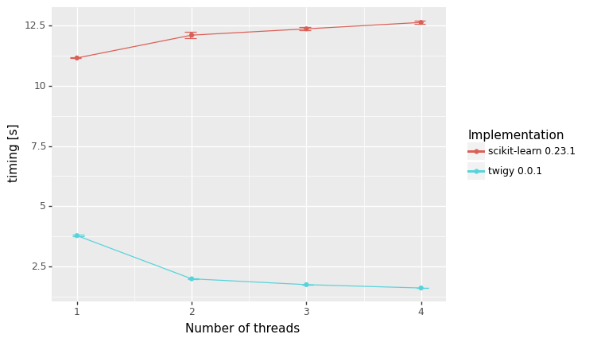

This repository contains a C++ implementation of the CART algorithm (currently, only supporting classification), offering a similar API for decision trees and random forests as the [sklearn](https://scikit-learn.org/stable/) implementation. In addition to the C++ library, the python package `twigy` offers python bindings for the main user facing classes.

# twigy

## Getting Started

There are the following three options to get started using twigy in python:

### 1. Use pip install 

`pip install twigy`

### 2. Build manylinux wheel from source

The manylinux wheel is build in a CentOS 7 docker container, so you need to have docker installed. Then run

`./build_manylinux_wheel.sh`

which will build the manylinux wheel. Then you can 

`pip install ./build/wheelhouse/twigy-0.0.1-cp36-cp36m-manylinux2014_x86_64.whl`

### 3. Build extension library from source

To directly build the python extension library, you need cmake >= 3.10 and boost >= 1.66 on your system.

`cd ./build && cmake ..`

`cmake --build . --target twigy`

## DecisionTreeClassifier

Implements a CART decision tree classifier. See also `./example.py` for usage. 

### Parameters

`impurity_measure` sets the measure of impurity used for the splits. Takes `twigy.ImpurityMeasure.gini` or `twigy.ImpurityMeasure.gini`. Default is `twigy.ImpurityMeasure.gini`.

`max_depth` sets the maximum depth to which the tree is grown. Default is `-1`,  which corresponds to no restriction on the depth.

`min_samples_split` sets the minimum number of samples for a node to be split. Default is `2`.

`min_samples_leaf` sets the minimum number of samples at a leaf node. Split that would lead to a lower number are not considered. Default is `1`. 

`max_features` sets the maximum number of randomly selected features to be considered at each split. Default is `-1`, which corresponds chosing the number of features accoding to the `max_features_method`.

`max_features_method` sets the method by which the number of features to be considerd at each split is chosen unless it is explicitly specified by `max_features`. Possible value `twigy.MaxFeaturesMethod.sqrt_method`, `twigy.MaxFeaturesMethod.log2_method` and `twigy.MaxFeaturesMethod.all_method`. Default is `twigy.MaxFeaturesMethod.all_method`.

`min_impurity_split` sets the minimal impurity for a node to be considered for another split. Default is `0.0`.

### Methods

`build_tree(X, y)` grows the tree on the training set given by the features `X` and the labels `y`. Note that the class labels need to be given by `0,1,2,..., n_classes - 1`. 

`print_tree()` print a list of the nodes of the decision tree.

`predict_classes(X)` predicts the class labels for the given samples `X`.

## RandomForestClassifier

Implements a random forest classifier. See also `./example.py` for usage.

### Parameters

`n_estimators` sets the number of decision tree estimators to train. 

`impurity_measure` sets the measure of impurity used for the splits. Takes `twigy.ImpurityMeasure.gini` or `twigy.ImpurityMeasure.gini`. Default is `twigy.ImpurityMeasure.gini`.

`max_depth` sets the maximum depth to which the tree is grown. Default is `-1`,  which corresponds to no restriction on the depth.

`min_samples_split` sets the minimum number of samples for a node to be split. Default is `2`.

`min_samples_leaf` sets the minimum number of samples at a leaf node. Split that would lead to a lower number are not considered. Default is `1`. 

`max_features` sets the maximum number of randomly selected features to be considered at each split. Default is `-1`, which corresponds chosing the number of features accoding to the `max_features_method`.

`max_features_method` sets the method by which the number of features to be considerd at each split is chosen unless it is explicitly specified by `max_features`. Possible value `twigy.MaxFeaturesMethod.sqrt_method`, `twigy.MaxFeaturesMethod.log2_method` and `twigy.MaxFeaturesMethod.all_method`. Default is `twigy.MaxFeaturesMethod.sqrt_method` (note that the default is different that for the `DecisionTreeClassifier`).

`min_impurity_split` sets the minimal impurity for a node to be considered for another split. Default is `0.0`.

`max_samples` sets the number of randomly selected samples to be used to train the individual trees. Default is `-1`, which corresponds to all samples being used for each tree. 

### Methods

`build_forest(X, y)` trains the random forest on the training set given by the features `X` and the labels `y`. Note that the class labels need to be given by `0,1,2,..., n_classes - 1`. 

`predict_classes(X)` predicts the class labels for the given samples `X`.

## Benchmark

twigy has been benchmarked (on an i3-7100 CPU @ 3.90 with 16GB memory) against scikit learn:

The benchmark shows that twigy is up to 8 times faster on this dataset. For more details see `benchmark.py`.

## C++ library

twigy can also be used as c++ library as illustrated in `example.cpp`. 

### Build cpp example from source

To build the example you need cmake >= 3.10 and boost >= 1.66 on your system. Then run 

`cd ./build && cmake ..`
 
`cmake --build . --target example`